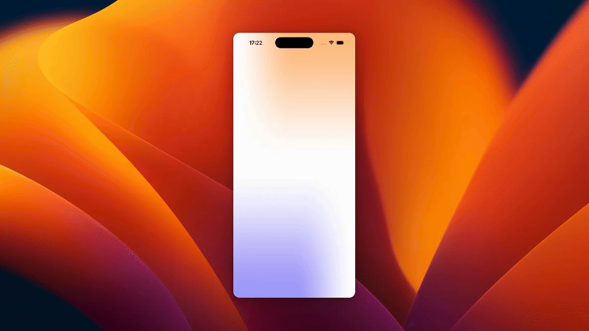

# OnboardingAnimation

SwiftUIで作成した、オンボーディング画面のアニメーションサンプルです。

## Overview

`Flow` というタイトルが表示され、画面上部へ移動したあと、説明文と `Continue` ボタンがフェードインします。背景には `MeshGradient` を使い、テキストにはカスタム `TextRenderer` による文字単位の出現アニメーションを適用しています。

## Features

- SwiftUIによるシンプルなオンボーディングUI
- `MeshGradient` を使った背景表現
- `Transition` と `TextRenderer` によるテキストアニメーション
- フェーズ管理による段階的な表示切り替え

## Requirements

- Xcode 17以降
- iOS 26.5以降
